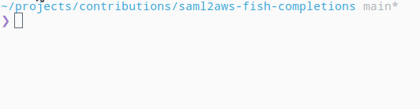

# saml2aws-fish-completions [![github-ci-badge]][github-ci-link]

> Provides full completion support for `saml2aws` in `Fish`



## Installation

```fish
fisher install ManoManoTech/saml2aws-fish-completions
```

## Usage

```fish
saml2aws <Tab>
```

## Credit

<a href="manomano.com">
    
</a>

</div>

## License

> MIT

[github-ci-link]: <https://github.com/ManoManoTech/saml2aws-fish-completions/actions> "Github CI"
[github-ci-badge]: <https://github.com/ManoManoTech/saml2aws-fish-completions/actions/workflows/.ci.yml/badge.svg>
[logo]: https://raw.githubusercontent.com/ManoManoTech/visual-assets/main/logo/logo-ManoMano-horizontal-RGB-hor-color-positif.svg
[manomano-website]: manomano.com
