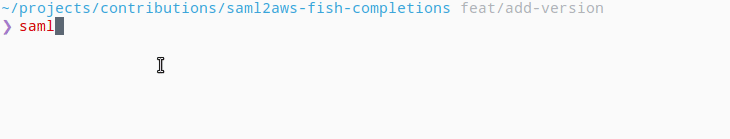

# saml2aws-fish-completions

> Provide basic Fish completion

## Installation

    fisher install edouard-lopez/saml2aws-fish-completions

:warning: Subcommand only expose global options, specific options need to be added (help welcome :)

## License

> MIT
